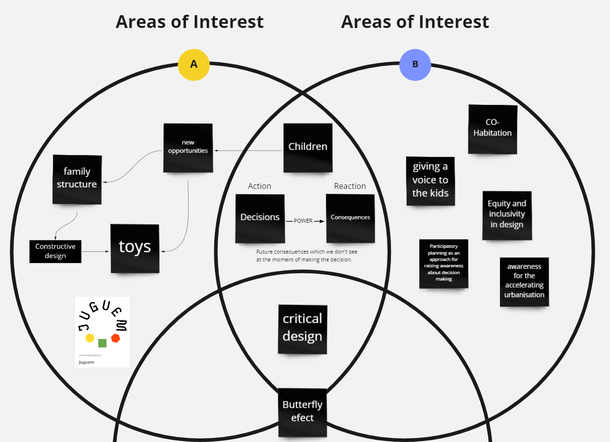

# Fab Academy Challenge II

#### By [Borbala Moravcsik](https://borbalamoravcsik.github.io/mdef-borka/Fabacademy-challenge2.html) & [Anna Mestres](https://anna-mestres.github.io/anna.mestres/fab/c2.html)

>Goal:
To raise awareness about the impact of our driven and individual decisions, by a critical design.

## Mindmap

## Initial Idea

This is a critical interactive design to create conversations at the DD, which will make our guests think about how their decisions and actions change something in the future they don't see at the moment and lead them to our individual research questions - about decisions in the present for future generations.

## Propose

Future consecuences which we don't see at the moment of making the decision.

## Team Plan

## System diagram

# Process

## Materials and Digital Fabrication

The materials that we choose to use for create the "" are:
  * Electronics:
    *  Adafruit ESP32 Feather
    *  6 x Resistors 10k
    *  1 x Resistor 330e
    *  6 Cables (2800mm x cable)
    *  6 buttons
    *  Supplier Power 5V
  * Ply wood (770 x 800 x 9.3 mm)
  * Filament
  * Tape doblesided
  * Acrylic white ice (760 x 505 x 4 mm)

The Digital Fabrication that we use are:

  * Laser cut (Trotec Speedy 400)
  * Rhino (Rhino 5 is the version to keep the files for make work the laser machine in this case and Rhino 6 to keep the files in CNC)
  * Illustrator (Inskcape it's open resource it could be used too)
  * CNC
  * Welders
  * Arduino IDE
  * 3D Printing Machine

## Flowchart and Coding

~~~
#include <FastLED.h>

#define LED_PIN     12
#define NUM_LEDS    60
#define BRIGHTNESS  64
#define LED_TYPE    WS2813

#define COLOR_ORDER GRB
#define button1 27
#define button2 33
#define button3 34
#define button4 39
#define button5 15
#define button6 36
CRGB leds[NUM_LEDS];
bool pres = false;
int seq = 0;

void setup() {
    delay( 3000 ); // power-up safety delay
    Serial.begin(9600);
    FastLED.addLeds<LED_TYPE, LED_PIN, COLOR_ORDER>(leds, NUM_LEDS).setCorrection( TypicalLEDStrip );
    FastLED.setBrightness(  BRIGHTNESS );
    pinMode(12, OUTPUT);
    pinMode(button1, INPUT);
    pinMode(button2, INPUT);
    pinMode(button3, INPUT);
    pinMode(button4, INPUT);
    pinMode(button5, INPUT);
    pinMode(button6, INPUT);
    clearAll();

}

void loop() {
  // put your main code here, to run repeatedly:
  if (digitalRead(button1) == LOW) {
    // pressed!
    Serial.println("Button 1");
    RandomPalette1(1);
    delay(500);

    if (seq == 0){
      seq = seq + 1;
      Serial.println("1");
      }
  }
  if (digitalRead(button2) == LOW) {
    // pressed!
    Serial.println("Button 2");
    RandomPalette1(2);
    delay(500);

    if (seq == 1){
      seq = seq + 1;
      Serial.println("2");
    }
    else {
      seq = 0;
    }
  }
  if (digitalRead(button3) == LOW) {
    // pressed!
    Serial.println("Button 3");
    RandomPalette1(3);
    delay(500);

    if (seq == 2){
      clearAll();
      Serial.println("Clear");
      seq = 0;
    }
    else {
      seq = 0;
    }
  }
  if (digitalRead(button4) == LOW) {
    // pressed!
    Serial.println("Button 4");
    RandomPalette1(4);
    delay(500);
    seq = 0;
  }
  if (digitalRead(button5) == LOW) {
    // pressed!
    Serial.println("Button 5");
    RandomPalette1(5);
    delay(500);
    seq = 0;
  }
  if (digitalRead(button6) == LOW) {
    // pressed!
    Serial.println("Button 6");
    RandomPalette1(6);
    delay(500);
    seq = 0;
  }
  if (pres == true){
    clearAll();

  }
}

//
void RandomPalette1(int hue)
{
    for( int i = 0; i < NUM_LEDS; i++) {
      if (random(0, 50) > 10) continue;
      switch(hue) {
        case 1:
          leds[i] = CRGB( 0, 255, random8());
          break;
        case 2:
          leds[i] = CRGB( random8(), 255, 0);
          break;
        case 3:
          leds[i] = CRGB( 255, 0, random8());
          break;
        case 4:
          leds[i] = CRGB( random8(), 0, 255);
          break;
        case 5:
          leds[i] = CRGB( 255, random8(), 0);
          break;
        case 6:
          leds[i] = CRGB( 0, random8(), 255);
          break;
      }

    }
    FastLED.show();
}

 void clearAll() {
    for( int i = 0; i < NUM_LEDS; i++) {
        leds[i] = CHSV( 0, 0, 0);
    }
    FastLED.show();
 }

~~~

### Thank you :)

